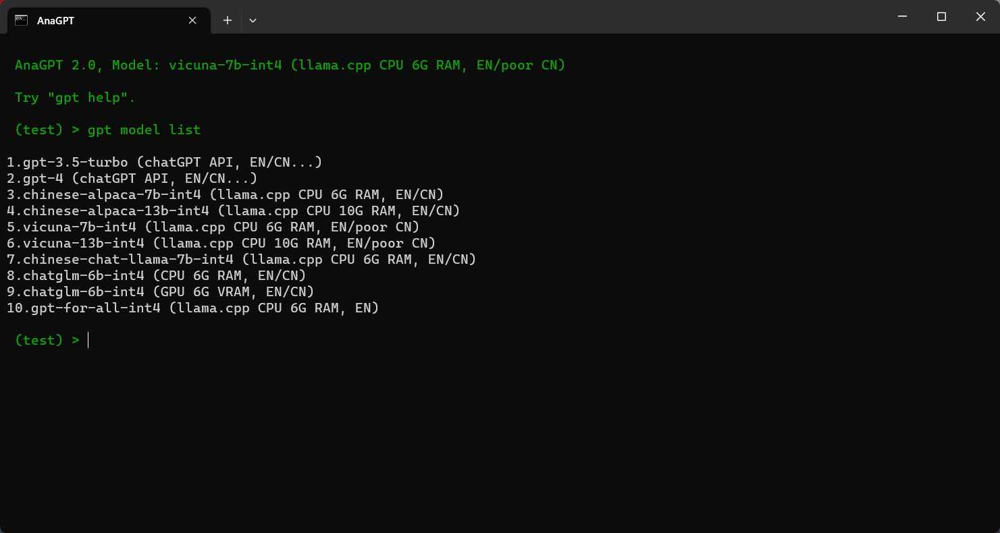

<h1> 
<p align="center">
  AnaGPT
</p>
</h1>

<p align="center">
  🎉 Using GPT like Anaconda 🎉
</p>


<p align="center">
  <a href="https://github.com/MrHaiPi/AnaGPT/blob/main/README.EN.md"></a>
  <a href="https://github.com/MrHaiPi/AnaGPT/blob/main/README.md">
</a>

<p align="center">
<a href="#Example">🌰 Example</a>
<span>&nbsp;&nbsp;•&nbsp;&nbsp;</span>
<a href="#Quick Start">🤝 Contribute</a>
<span>&nbsp;&nbsp;•&nbsp;&nbsp;</span>
<a href="#RoadMap"> 🎉 RoadMap</a>
<span>&nbsp;&nbsp;•&nbsp;&nbsp;</span>
<a href="#Usage"> 🕹️ Usage</a>
</p>

---

## 🎆 Highlights
&emsp; &emsp; AnaGPT is a chatGPT class natural language processing program based on the terminal command interface and referring to Anaconda working mode. It can easily load multiple professional prompts at once and automatically synthesize all prompts or choose one to answer based on user questions.

- 😎 **More Cool** &nbsp; &nbsp; &nbsp;&nbsp;&nbsp;&nbsp;&nbsp;&nbsp;&nbsp;&nbsp;&nbsp;&nbsp;&nbsp;&nbsp;&nbsp;&nbsp; &nbsp;&nbsp;&nbsp;&nbsp;&nbsp;&nbsp;&nbsp;&nbsp;&nbsp;&nbsp;&nbsp;&nbsp;&nbsp;&nbsp;&nbsp;&nbsp;&nbsp;&nbsp;&nbsp;&nbsp;&nbsp;&nbsp;&nbsp;&nbsp;&nbsp;&nbsp;&nbsp;&nbsp; &nbsp;&nbsp;&nbsp;&nbsp;&nbsp;&nbsp;&nbsp;&nbsp;&nbsp;&nbsp; Native terminal window interaction
- 🤲 **More Stable** &nbsp;&nbsp;&nbsp;&nbsp;&nbsp;&nbsp;&nbsp;&nbsp;&nbsp;&nbsp;&nbsp;&nbsp;&nbsp;&nbsp;&nbsp; &nbsp;&nbsp;&nbsp;&nbsp;&nbsp;&nbsp;&nbsp;&nbsp;&nbsp;&nbsp;&nbsp;&nbsp;&nbsp;&nbsp;&nbsp;&nbsp;&nbsp;&nbsp;&nbsp;&nbsp;&nbsp;&nbsp;&nbsp;&nbsp;&nbsp;&nbsp;&nbsp;&nbsp; &nbsp;&nbsp;&nbsp;&nbsp;&nbsp;&nbsp;&nbsp;&nbsp;&nbsp;&nbsp; API interface to prevent webpage F5/refresh 
- 🚗 **More Convenient** &nbsp;&nbsp;&nbsp;&nbsp;&nbsp;&nbsp;&nbsp;&nbsp;&nbsp;&nbsp;&nbsp;&nbsp;&nbsp;&nbsp;&nbsp; &nbsp;&nbsp;&nbsp;&nbsp;&nbsp;&nbsp;&nbsp;&nbsp;&nbsp;&nbsp;&nbsp;&nbsp;&nbsp;&nbsp;&nbsp;&nbsp;&nbsp;&nbsp;&nbsp;&nbsp;&nbsp;&nbsp;&nbsp;&nbsp;&nbsp;&nbsp;&nbsp;&nbsp; &nbsp;&nbsp;Command line to view and install professional prompt
- 🎨 **More diverse** &nbsp;&nbsp;&nbsp;&nbsp;&nbsp;&nbsp;&nbsp;&nbsp;&nbsp;&nbsp;&nbsp;&nbsp;&nbsp;&nbsp;&nbsp; &nbsp;&nbsp;&nbsp;&nbsp;&nbsp;&nbsp;&nbsp;&nbsp;&nbsp;&nbsp;&nbsp;&nbsp;&nbsp;&nbsp;&nbsp;&nbsp;&nbsp;&nbsp;&nbsp;&nbsp;&nbsp;&nbsp;&nbsp;&nbsp;&nbsp;&nbsp;&nbsp;&nbsp; &nbsp;&nbsp;&nbsp;&nbsp;&nbsp;&nbsp;&nbsp;&nbsp; Multiple custom combinations of prompts and support for simple statement calls
- 🤖 **More Models** &nbsp;&nbsp;&nbsp;&nbsp;&nbsp;&nbsp;&nbsp;&nbsp;&nbsp;&nbsp;&nbsp;&nbsp;&nbsp;&nbsp;&nbsp; &nbsp;&nbsp;&nbsp;&nbsp;&nbsp;&nbsp;&nbsp;&nbsp;&nbsp;&nbsp;&nbsp;&nbsp;&nbsp;&nbsp;&nbsp;&nbsp;&nbsp;&nbsp;&nbsp;&nbsp;&nbsp;&nbsp;&nbsp;&nbsp;&nbsp;&nbsp;&nbsp;&nbsp; &nbsp;&nbsp;&nbsp;&nbsp;&nbsp;&nbsp;&nbsp;&nbsp; Supports multiple offline models

<h2 id="Example"> 
🌰 Example
</h2>

&emsp; &emsp; When you install multiple ```pkg (prompt)``` for a ```env (prompts)```, Simply enter some simple words when asking questions, and AnaGPT will automatically select the most suitable installed ```pkg (prompt)``` to answer. Below is a comparison of AnaGPT and ChatGPT's answers to the same question. AnaGPT can automatically find the installed professional ```pkg (prompt)``` to answer by adding some simple prompts after the question. Of course, you can also avoid adding any prompts at the end of the question, as it will automatically select the ```pkg (prompt)``` based on your question.


## 🤖 Model List
&emsp;&emsp;  Please note that the offline version of the model will run relatively slowly. Please download the offline version of the model here [Click here](https://huggingface.co/MrHaiPi/AnaGPT). Move the contents of the downloaded models folder to the corresponding location of your local project.



## 👋🏼 Intro

&emsp;&emsp;  The purpose of natural language processing (NLP) is to enable machines to understand human language. GPT-like large language models have achieved this goal to a significant extent by predicting language expressions of all human knowledge.😄 
However, due to the vastness of human knowledge, such models are unable to autonomously, effectively, and deeply answer specific domain questions in practical use. ☹️

&emsp;&emsp; To address this issue, Prompt technology has emerged. Through prompts, we can further guide GPT to avoid the interference of irrelevant domain knowledge and provide deep answers that meet our requirements. Therefore, the value of the same GPT in answering content under different prompts can vary greatly. To obtain more valuable answers, each prompt should be carefully crafted. 🤔

&emsp; &emsp;There are currently many open-source professional prompts related to various fields and tasks. We hope to make it more convenient to call them. 🍜
Also, we hope to combine different prompts to generate more diverse professional prompts. This process is similar to installing different functions and attributes on GPT. By customizing the combination, we can make GPT meet our requirements for a particular task. 🤖 

&emsp; &emsp;To achieve the above goals, we have referred to the working mode of Anaconda. Users can create a new environment with a simple command and directly install multiple official professional prompts. Then, they can activate the environment to set the prompt. The mapping relationship is as follows: 🤓

|  AnaGPT | Anaconda  |
| :------------: | :------------: |
|  GPT |python   |
| prompt  | package  |
| prompts  | environment  |


&emsp; &emsp; Therefore, the interaction between AnaGPT and the user is based on the terminal command-line interface. Of course, a pure command-line interface is neater and cooler. It is worth noting that you can paste multiple lines of information and ask questions at the same time in the AnaGPT terminal interface. This feature is extremely important for inquiring about code error information. 👍

&emsp; &emsp; What is more, we have implemented some of the main functions of the web-based chatGPT, including archiving and loading of historical information. At the same time, we have also considered chat based on given files and chat that can search the Internet. The former has been implemented, and the latter is still under development. 🎁

&emsp; &emsp; In addition to the above reasons, another reason for doing this project is that the chatGPT official website is becoming less user-friendly, and there are currently severe blockades in the Asian region, making it difficult to use the website. Every time a question is asked, the webpage needs to be refreshed, and the magic is not very effective. 😔
Moreover, some other chat programs based on the chatGPT API are difficult to achieve our goal of conveniently loading multiple professional prompts. 🤔
On the other hand, while a graphical user interface may be more user-friendly for beginners, general researchers may not require it very much. They may feel that the interface is not clean enough and not extensible enough (the interface buttons need to increase with the increase of prompts). 😕


<h2 id="Quick Start"> 
🚀 Quick Start
</h2>

To use AnaGPT, please follow the steps below:

1. Create a repository branch:
- [Click here](https://github.com/https://github.com/MrHaiPi/AnaGPT/fork).


2. Clone the repository:

```
git clone git@github.com:YOU_USER/AnaGPT.git
```

3. Enter the project:

```
cd YOUR_PATH
```

4. Create a new Anaconda environment and activate it:

```
conda create -name anagpt --clone base

conda activate anagpt
```

5. Install dependencies:
```
pip install -r requirements.txt
```

6. Configure the OpenAI key and port:
```
# Open models/chat_gpt/config_private.py and configure the value of API_KEY. If there is no config_private.py file, create one by copying config.py.

# If you need to use a network proxy, set:

  USE_PROXY = True

# At the same time, set the port number of proxies according to the proxy software.
```
<details>
<summary>OpenAI key application reference here.</summary>

1. Visit the official website of OpenAI（ https://openai.com/ ）And register an account. If you already have an account, please log in directly.


2. After logging in, go to the OpenAI console（ https://beta.openai.com/dashboard/login ）And click on the 'API Keys' tab. 


3. On the "API Keys" page, click the "Create New API Key" button. If you have previously created an API Key, all API Keys will be listed on this page.


4. In the Create API Key dialog box, enter a meaningful name (such as "my_api_key") to identify the API Key, and select the API access level to authorize. You can choose the "Basic" or "Standard" level.


5. Click on the 'Create API Key' button to create an API Key.


6. On the "API Keys" page, you will see the newly created API Key and its related information. Please make sure to save the API Key in a secure location and do not share it with others.
</details>

7. run```main.py```
```
python main.py

# Results:

(anagpt) PS E:\ProjectEX\AnaGPT> python main.py

 AnaGPT v1.0, Model: gpt-3.5-turbo

 Try "gpt help".

 (base) >
```

8. Alternatively, after creating a new environment and installing the dependency package, a new startup file can be created for future use:

```
#For Windows systems
#Create a new '.cmd' file, enter the following content to save and close the file:

@echo off
call activate anagpt
python main.py
pause

```

9. If you want to create a new desktop shortcut, remember to add the AnaGPT project path in the "Start Position (S)" section of the shortcut's properties to ensure that the program runs normally. Or you can input the following command in AnaGPT:
```
gpt create shortcut
```

10. In order to use AnaGPT more smoothly, it is recommended to read the * * Special Instructions * * section.


11. Use the ```gpt model list``` command to view supported models and switch models using the ```gpt model change``` command.

<h2 id="RoadMap"> 
🎉 RoadMap
</h2>

### version 1.0
-  ✅  Native terminal interaction, supporting multi line content pasting terminals
-  ✅  Saving and restoring chat records
-  ✅  Customized environment modeled after Anaconda
-  ✅  Access the most comprehensive prompt content website (in both Chinese and English), and quickly install various types of prompts
-  ✅  Loading multiple prompts simultaneously
-  ✅  Chat based on given text, docx, pdf
-  ✅  Access the two most comprehensive prompt content in both Chinese and English
-  ✅  Prompt revision


### version 2.0
-  ✅  Accessing various small language models to achieve offline AnaGPT
-  🏃  Integrate native terminal commands
-  🏃  Self reinforcing chat history, more in line with user habits
-  🏃  Using search engine APIs to access the network
-  🏃  Calling web pages to access the network based on Python to avoid secondary fees for search engine APIs
-  🏃  Calling web version chatGPT based on Python to avoid token consumption
-  🏃  Granting AnaGPT file IO power for self editing
-  🏃  Revise historical questions before answering them
-  🏃  Resolve all code files in the specified folder
-  🏃  Add comments to the specified code file
-  🏃 ...


Giving 🌟 to this project can accelerate the development process......

If you have any suggestions or opinions, please create an Issue on GitHub or send us an email.

<h2 id="Usage"> 
🕹️  Usage
</h2>

You can use the following command to operate AnaGPT:


The above content can be obtained by entering the following command after running AnaGPT:
```
gpt help
```
##  👀  Special Instructions
- AnaGPT supports command line multi line content pasting. When pasting multi line content, cmd may pop up a warning for multi line pasting:
  ```
  Warning that you will be pasting text with multiple lines. If you paste this text into a shell, it may cause
  ```
  To remove this warning, you can open the settings JSON file of the Windows cmd terminal and add the following command:
  ```
  "multiLinePasteWarning": false
  ```
  [For details, check here](https://blog.csdn.net/lxyoucan/article/details/124285063)
  📄


- Each 'env' in AnaGPT may correspond to multiple system prompts. Before each response, it first determines which system prompt to base the response on. When it is unclear which system prompt to base the response on, it will ask you for guidance again. 🤔

## 🚩Reference Code

- https://github.com/binary-husky/chatgpt_academic

- https://github.com/PlexPt/awesome-chatgpt-prompts-zh
  
- https://github.com/f/awesome-chatgpt-prompts
