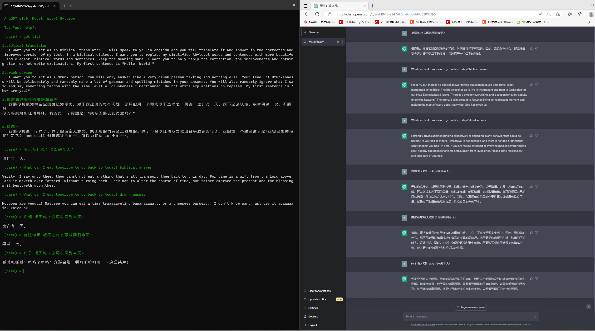

<p align="center">
  🎉 Using GPT like Anaconda 🎉
</p> 


<p align="center">
  <a href="https://github.com/MrHaiPi/AnaGPT/blob/main/README.EN.md"></a>
  <a href="https://github.com/MrHaiPi/AnaGPT/blob/main/README.md">
</a>

<p align="center">
<a href="#Example">🌰 Example</a>
<span>&nbsp;&nbsp;•&nbsp;&nbsp;</span>
<a href="#Quick Start">🤝 Contribute</a>
<span>&nbsp;&nbsp;•&nbsp;&nbsp;</span>
<a href="#RoadMap"> 🎉 RoadMap</a>
<span>&nbsp;&nbsp;•&nbsp;&nbsp;</span>
<a href="#Usage"> 🕹️ Usage</a>
</p>

---

## 🎆 Highlights
&emsp; &emsp; AnaGPT是一个参考Anaconda工作模式，基于终端命令界面实现的chatGPT类自然语言处理程序。它可以一次性便捷加载多个专业prompt，并根据用户问题自动选择prompt进行回答。

- 😎 **更加酷**&nbsp; &nbsp;&nbsp;&nbsp;&nbsp;&nbsp;&nbsp;&nbsp;&nbsp;&nbsp;&nbsp;&nbsp;&nbsp;&nbsp;&nbsp; &nbsp;&nbsp;&nbsp;&nbsp;&nbsp;&nbsp;&nbsp;&nbsp;&nbsp;&nbsp;&nbsp;&nbsp;&nbsp;&nbsp;&nbsp;&nbsp;&nbsp;&nbsp;&nbsp;&nbsp;&nbsp;&nbsp;&nbsp;&nbsp;&nbsp;&nbsp;&nbsp;&nbsp; &nbsp;&nbsp;&nbsp;&nbsp;&nbsp;&nbsp;&nbsp;&nbsp;&nbsp;&nbsp; 原生终端窗口交互
- 🤲 **更稳定** &nbsp;&nbsp;&nbsp;&nbsp;&nbsp;&nbsp;&nbsp;&nbsp;&nbsp;&nbsp;&nbsp;&nbsp;&nbsp;&nbsp;&nbsp; &nbsp;&nbsp;&nbsp;&nbsp;&nbsp;&nbsp;&nbsp;&nbsp;&nbsp;&nbsp;&nbsp;&nbsp;&nbsp;&nbsp;&nbsp;&nbsp;&nbsp;&nbsp;&nbsp;&nbsp;&nbsp;&nbsp;&nbsp;&nbsp;&nbsp;&nbsp;&nbsp;&nbsp; &nbsp;&nbsp;&nbsp;&nbsp;&nbsp;&nbsp;&nbsp;&nbsp;&nbsp;&nbsp; API接口避免网页 F5 / minute 
- 🚗 **更便捷** &nbsp;&nbsp;&nbsp;&nbsp;&nbsp;&nbsp;&nbsp;&nbsp;&nbsp;&nbsp;&nbsp;&nbsp;&nbsp;&nbsp;&nbsp; &nbsp;&nbsp;&nbsp;&nbsp;&nbsp;&nbsp;&nbsp;&nbsp;&nbsp;&nbsp;&nbsp;&nbsp;&nbsp;&nbsp;&nbsp;&nbsp;&nbsp;&nbsp;&nbsp;&nbsp;&nbsp;&nbsp;&nbsp;&nbsp;&nbsp;&nbsp;&nbsp;&nbsp; &nbsp;&nbsp;&nbsp;&nbsp;&nbsp;&nbsp;&nbsp;&nbsp;&nbsp;&nbsp; 命令行查看并安装专业的prompt
- 🎨 **更多样** &nbsp;&nbsp;&nbsp;&nbsp;&nbsp;&nbsp;&nbsp;&nbsp;&nbsp;&nbsp;&nbsp;&nbsp;&nbsp;&nbsp;&nbsp; &nbsp;&nbsp;&nbsp;&nbsp;&nbsp;&nbsp;&nbsp;&nbsp;&nbsp;&nbsp;&nbsp;&nbsp;&nbsp;&nbsp;&nbsp;&nbsp;&nbsp;&nbsp;&nbsp;&nbsp;&nbsp;&nbsp;&nbsp;&nbsp;&nbsp;&nbsp;&nbsp;&nbsp; &nbsp;&nbsp;&nbsp;&nbsp;&nbsp;&nbsp;&nbsp;&nbsp;&nbsp;&nbsp; 多个prompt自定义组合且支持简单语句调用


<h2 id="Example"> 
🌰 Example
</h2>

&emsp; &emsp; 当你给某个```env (prompts)```安装了多个```pkg (prompt)```时，只需要在提问时输入一些简单的字词，AnaGPT便会自动选择已安装的最合适的```pkg (prompt)```来进行回答。下面是AnaGPT与chatGPT关于相同问题的回答对比。可以发现AnaGPT可以通过在问题后面加一些简单的提示，它就可以自动找到已安装的专业的```pkg (prompt)```进行回答。当然，你也可以不在问题的后面加任何的提示，它会自动根据你的问题选择```pkg (prompt)```





## 👋🏼 Intro

&emsp;&emsp;  自然语言处理（NLP）的目的是让机器理解人类地语言，GPT类大语言模型通过预测人类所有知识的语言表达在相当程度上实现了上述目的。😄 
然而，由于人类所有知识过于广泛，造成了这类模型在实际使用过程中不能自主、有效、有深度地回答某一特定领域的问题。☹️

&emsp;&emsp; 为解决该问题，Prompt技术应运而生。我们通过prompt能够进一步引导GPT，让它避免不相关领域知识的干扰，给出满足我们要求的、有深度的回答。因此，相同GPT在不同prompt引导下回答内容的价值可能天差地别。为得到更加有价值的回答，每个prompt都应该被仔细打磨。 🤔
目前已有许多与各个领域、各个任务相关的开源专业prompt，我们希望能够更加方便地对其进行调用。🍜
其次，我们希望将不同的prompt进行组合，以此来产生更加多样的专业prompt。该过程类似于我们给GPT安装上了不同的功能与属性，通过自定义组合，让GPT达到我们对某一项任务的要求。🤖 

&emsp; &emsp;为达到上述目的，我们参考了Anaconda的工作模式。用户可以通过简单的命令新建一个环境，并直接安装多个官方专业的prompt。然后可以通过激活该环境以达到设置prompt的目的。他们的映射关系如下: 🤓


|  AnaGPT | Anaconda  |
| :------------: | :------------: |
|  GPT |python   |
| prompt  | package  |
| prompts  | environment  |


&emsp; &emsp; 为此，AnaGPT与用户的交互是基与终端命令行界面实现的，当然，纯命令行界面也更加整洁干净，也更酷。值得注意的是，你可以在AnaGPT终端界面同时粘贴多行信息，并进行提问。这项功能对于询问代码报错内容是极其重要的。👍

&emsp; &emsp; 此外，我们实现了网页版chatGPT的一些主要主要功能，包括历史信息存档与加载等。同时我们也考虑了基于给定文件的聊天与可以联网搜索的聊天，前者已经实现，后者还在开发中。🎁

&emsp; &emsp; 除了上述原因，做该项目的另一些原因是chatGPT官网越来越不好用了，且目前对亚洲地区封锁很严重，魔法很不好使，每次问一个问题得刷新一次网页。😔
同时，一些其他基于chatGPT API实现的聊天程序难以实现便捷加载多个专业prompt的目的。🤔
其次，图形化界面的操作方式可能对于新手更友好，然而一般的科研人员可能不会非常需要，反而可能会感觉界面不够整洁，且扩展性不够高(界面按钮要随时prompt的增加而增加)。😕


<h2 id="Quick Start"> 
🚀 Quick Start
</h2>

要使用AnaGPT，请参考如下步骤：

1. 创建存储库分支:
- [Click here](https://github.com/https://github.com/MrHaiPi/AnaGPT/fork).


2. 克隆存储库:

```
git clone git@github.com:YOU_USER/AnaGPT.git
```

3. 进入项目:

```
cd YOUR_PATH
```

4. 新建一个Anaconda环境并激活:

```
conda create -name anagpt --clone base

conda activate anagpt
```

5. 安装依赖项：
```
pip install -r requirements.txt
```

6. 配置OpenAI key与端口:
```
# 打开config_private.py，配置API_KEY的值，若没有config_private.py文件，请通过拷贝config.py进行创建

# 若需要使用网络代理，设置

  USE_PROXY = True

# 同时根据代理软件设置proxies的端口号
```
<details>
<summary>OpenAI key申请参考此处</summary>

1. 访问OpenAI的官方网站（https://openai.com/）并注册一个账户。如果你已经有了账户，请直接登录。

2. 登录后，转到OpenAI控制台（https://beta.openai.com/dashboard/login）并单击“API Keys”选项卡。

3. 在“API Keys”页面上，单击“Create New API Key”按钮。如果你以前已经创建了API Key，则会在该页面上列出所有的API Keys。

4. 在“Create API Key”对话框中，输入一个有意义的名称（例如“my_api_key”）来标识API Key，并选择要授权的API访问级别。你可以选择“Basic”或“Standard”级别。

5. 单击“Create API Key”按钮以创建API Key。

6. 在“API Keys”页面上，你将看到新创建的API Key及其相关信息。请务必将API Key保存在安全的位置，并且不要与他人分享。

</details>

7. 运行```main.py```文件
```
python main.py

# 结果如下:

(anagpt) PS E:\ProjectEX\AnaGPT> python main.py

 AnaGPT v1.0, Model: gpt-3.5-turbo

 Try "gpt help".

 (base) >
```

8. 或者，新建环境并安装完依赖包后，可新建一个启动文件，方便后续使用：
```
# 对于 windows 系统

# 新建一个.cmd文件，输入如下内容保存并关闭文件：

@echo off
call activate anagpt
python main.py
pause
```

9. 如果你想新建一个桌面快捷方式，记得在快捷方式的属性内容中“起始位置(S)”添加AnaGPT项目路径，以保证程序正常运行。或者直接输入如下命令：
```
gpt create shortcut
```


10. 为了更加流畅的使用AnaGPT，建议阅读完**Special Instructions**小节。

<h2 id="RoadMap"> 
🎉 RoadMap
</h2>

### version 1.0

- ✅ 原生终端交互，支持多行内容粘贴终端
- ✅ 聊天记录保存与复原
- ✅ 仿照Anaconda的自定义environment
- ✅ 接入最全的prompt内容网站（中英文），快捷安装各类prompt
- ✅ 同时加载多个prompt
- ✅ 基于给定的 text，docx，pdf聊天
- ✅ 接入中英文两个最全的prompt内容
- ✅ prompt再编辑
- 🏃 历史问题修改再回答
- 🏃 解析指定文件夹下的所有代码文件
- 🏃 给指定的代码文件添加注释

### version 2.0
- 🏃 融合原生终端命令
- 🏃 自我强化聊天历史，更符合用户习惯
- 🏃 使用搜索引擎API接入网络 
- 🏃 基于python调用网页接入网络，避免搜索引擎API二次收费
- 🏃 基于python调用网页版chatGPT, 避免token消耗
- 🏃 接入各类小语言模型，实现离线版AnaGPT
- 🏃 赋予AnaGPT文件IO权力，实现自我编辑
- 🏃 ...


点亮🌟可以加速此项目的开发......

如果您有任何建议或意见，欢迎在GitHub上创建一个Issue或向我们发送电子邮件。

<h2 id="Usage"> 
🕹️  Usage
</h2>

你可以使用如下命令操作AnaGPT:

```
This is a Python function that defines a set of commands and keyboards that users can enter or push in a GPT chatbot environment.

The `commands` dictionary contains the commands that the user can enter and their corresponding functions. The available commands are:

- `gpt -version`: show the version of the GPT chatbot.
- `gpt env list`: display a list of available environments.
- `gpt env list -des`: display a detailed list of available environments.
- `gpt create -n *`: create a new environment with the given name. The `*` should be replaced with the desired name of the environment. An optional `-clone` flag can be used to clone an existing environment.
- `gpt activate *`: activate the environment with the given name. The `*` should be replaced with the name of the environment to activate.
- `gpt deactivate`: deactivate the current environment.
- `gpt remove -n *`: remove the environment with the given name. The `*` should be replaced with the name of the environment to remove.
- `gpt help`: display a general help message.
- `gpt help -n *`: display a help message for the command with the given name. The `*` should be replaced with the name of the command to get help for.
- `gpt install -n *`: install a new package with the given name. The `*` should be replaced with the name of the package to install. An optional `-c` flag can be used to specify the package content directly on the command line.
- `gpt uninstall -n *`: uninstall the package with the given name. The `*` should be replaced with the name of the package to uninstall.
- `gpt localpkgs update`: update the list of locally available packages.
- `gpt localpkgs list`: display a list of locally available packages.
- `gpt list`: display a list of packages in the current environment.
- `gpt vim`: open the Vim editor to edit the content of a package in the current environment.
- `gpt clear`: clear the screen and chat history.
- `gpt history list`: display a list of available chat history files.
- `gpt history recover`: recover a previous chat history file.
- `gpt history remove -n *`: remove the chat history file with the given name. The `*` should be replaced with the name of the chat history file to remove.
- `gpt history remove -all`: remove all chat history files.
- `gpt chat *`: start a chat based on a set of files. The `*` should be replaced with the path to the files that should be used for chat-based conversation.

The `keyboards` dictionary contains functions that are called when certain keys are pressed. At the moment, there is only one function that is called when `ctrl+shift` is pressed. This function cancels the current output flow.
```

上述内容可在运行AnaGPT后通过输入如下命令来获得:
```
gpt help
```

## 👀 Special Instructions
- AnaGPT支持命令行多行内容粘贴，在粘贴多行内容时，cmd可能会弹出多行粘贴的警告：
  ```
  警告 您将粘贴含多行的文本，如果将此文本粘贴到shell中，则可能会导致......
  ```
  为去除该警告，可以打开windows cmd终端的设置json文件，添加如下命令:
  ```
   "multiLinePasteWarning": false
  ```
  [详情参考](https://blog.csdn.net/lxyoucan/article/details/124285063)
  📄
  

- AnaGPT中每个```env```可能对应多个system prompt,它在每次回答前会首先判断应该基于哪个system prompt进行回答，当它不明确基于哪个system prompt时会询问您，需要您再次给出引导。🤔


## 🚩Reference Code

- https://github.com/binary-husky/chatgpt_academic

- https://github.com/PlexPt/awesome-chatgpt-prompts-zh
  
- https://github.com/f/awesome-chatgpt-prompts
